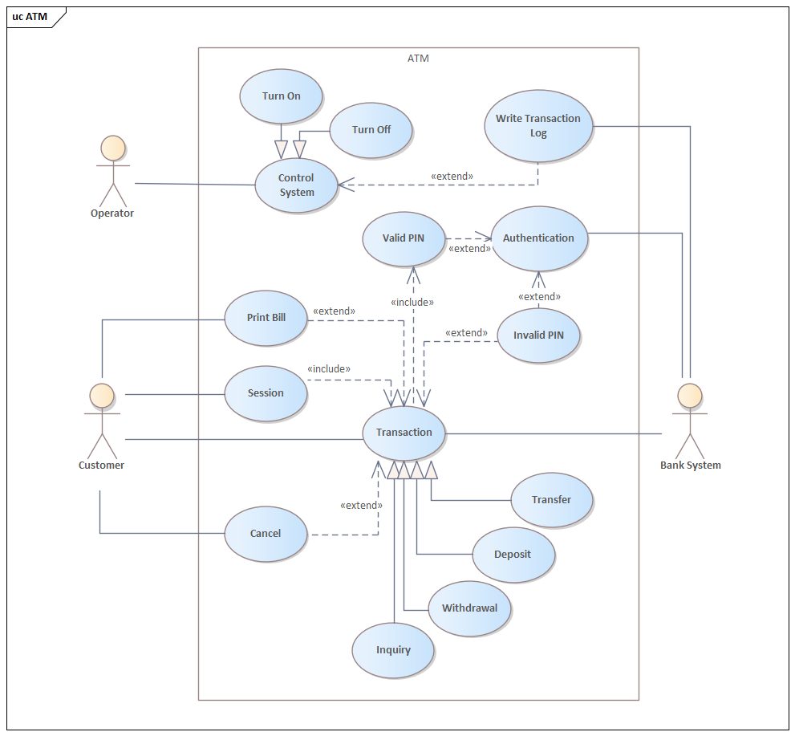
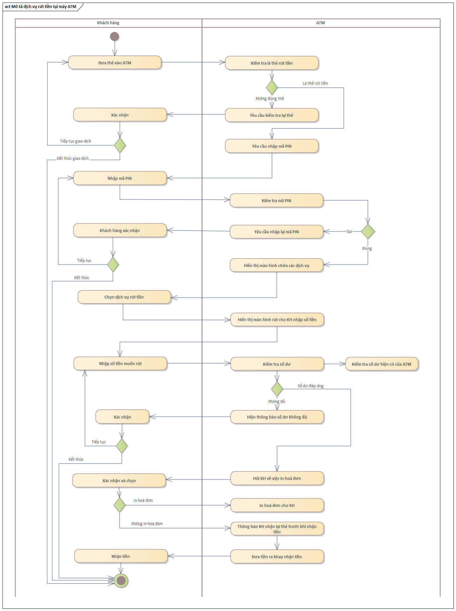
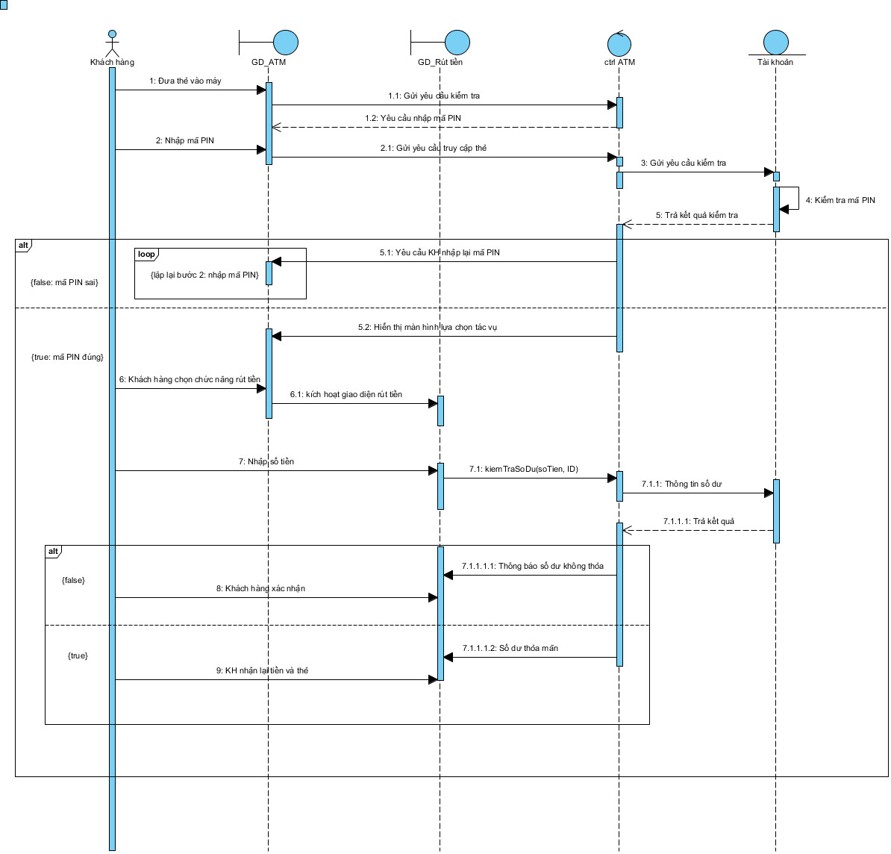
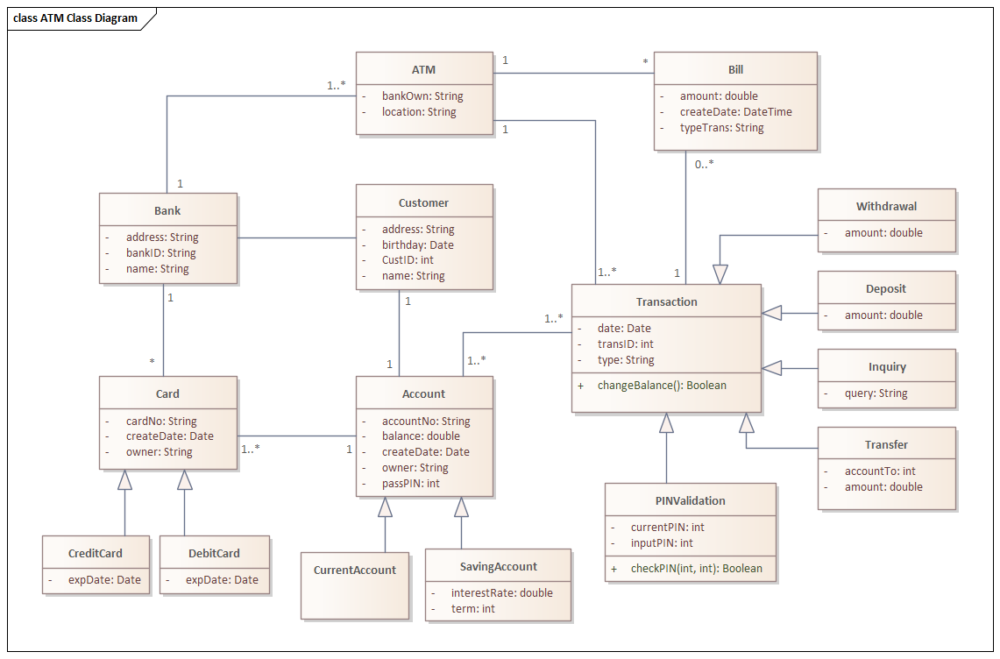
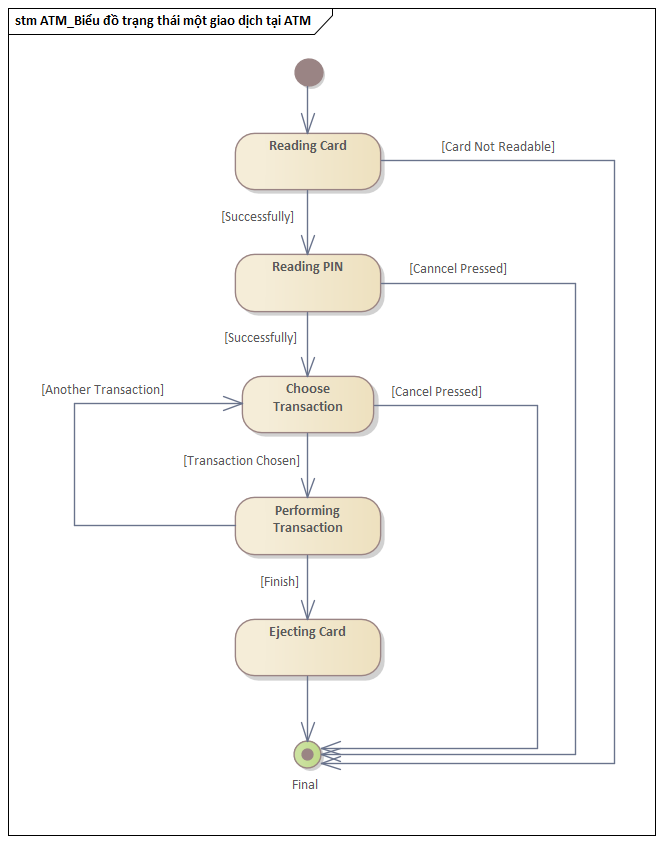

#### Thông tin

Sinh viên: Châu Bích Tuyền - 20067001

Môn học: Kiến trúc và Thiết kế phần mềm

### Nội dung thực hành

Tuần 01: Vẽ các sơ đồ cho đặc tả máy rút tiền tự động (ATM)

Công cụ sử dụng:

Enterprise Architect

Visual Paradigm for UML

##### 1. Usecase Diagram

##### 2. Activity Diagram

##### 3. Sequence Diagram

##### 4. Class Diagram

##### 5. State Diagram

